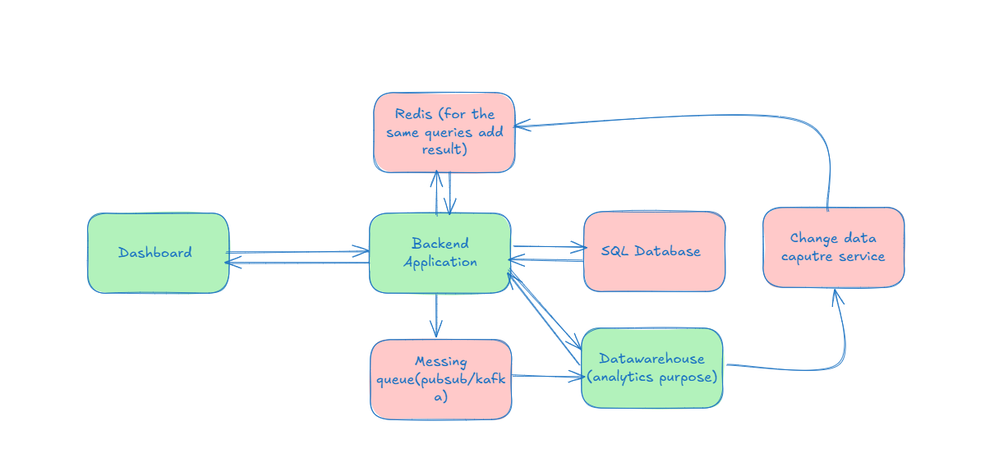

# Dynamic Dashboard API Project

## **Objective**
The objective of this project is to create **APIs** to fetch information from the **data warehouse** for **dynamic dashboard creation**.  

The dashboard will allow selecting **dimensions** (e.g., agent or manager) and **aggregation metrics** (e.g., total leads, average conversion rate, average call duration) to visualize data efficiently.

---

## **Architecture**



**Note:** Green-marked portions indicate the modules being implemented in this project. The design is built with **scalability** in mind.

**Architecture Overview:**
- Events are generated when an **agent ends a call**.  
- These events are sent to a **Pub/Sub** or messaging queue.  
- Events are ingested into the **BigQuery data warehouse** (for now using CSV/JSON files for simulation).  
- **FastAPI** services query the data warehouse to provide results to the dynamic dashboard.  
- **Streamlit** is used to render the dashboard UI.

---

## **Tools & Technologies**
- **Python** – Backend API development  
- **BigQuery** – Data warehouse (using CSV files initially)  
- **SQL / JSON** – Data simulation and querying  
- **FastAPI** – API framework  
- **Streamlit** – Dashboard frontend

---

## **Data Warehouse Mapping**

The warehouse is designed to support **fast aggregations** for agents and managers.  

| **Column Name**  | **Data Type** | **Description** |
|-----------------|---------------|-----------------|
| lead_id          | STRING        | Unique lead identifier |
| assigned_by      | STRING        | Manager who assigned the lead |
| assigned_to      | STRING        | Agent handling the lead |
| assigned_date    | DATE          | Date of assignment |
| status           | STRING        | Current status of the lead (`converted_yes`, `converted_no`, `followup_pending`) |
| call_duration    | FLOAT         | Duration of the call in seconds |
| call_status      | STRING        | Status of the call (`answered` or `missed`) |
| is_hot           | BOOLEAN       | 1 if the lead is hot, otherwise 0 |
| is_warm          | BOOLEAN       | 1 if the lead is warm, otherwise 0 |
| is_cold          | BOOLEAN       | 1 if the lead is cold, otherwise 0 |

> This schema is sufficient to perform aggregations like **total calls**, **conversion rates**, and **lead type analysis**.

---

## **Project Structure**
project/
├── data/
│ ├── warehouse/
│ │ └── warehouse.csv # Source data file
│ └── sql_database/
│ └── aggregationmapping.json # Defines aggregation fields per dimension
├── utils/
│ ├── file_utils.py # Loads JSON mapping
│ └── function_utils.py # Core logic for aggregations
├── main.py # FastAPI entrypoint
└── README.md # Documentation


## **APIs**
### **1) /dimension-mapping**

**Input Payload:** None

**Output:**
```json
{
    "agent_id": {
        "aggregation_fields": [
            "total_calls",
            "answered_calls",
            "missed_calls",
            "conversion_rate",
            "avg_call_duration",
            "hot_deals_count",
            "warm_deals_count",
            "cold_deals_count"
        ]
    },
    "manager_id": {
        "aggregation_fields": [
            "total_agents",
            "total_leads",
            "leads_converted",
            "avg_team_conversion_rate"
        ]
    }
}


2) /dashboard-data

Input Payload
{
  "dimension": "agent_id",
  "metrics": ["total_calls", "conversion_rate", "avg_call_duration", "answered_calls", "missed_calls", "hot_deals_count"],
  "start_date": "2025-09-01",
  "end_date": "2025-10-25"
}

Output Payload: 

{
    "data": {
        "A201": {
            "total_calls": 11,
            "answered_calls": 6,
            "missed_calls": 5,
            "conversion_rate": 18.18,
            "avg_call_duration": 315.09,
            "hot_deals_count": 4
        },
        "A202": {
            "total_calls": 19,
            "answered_calls": 13,
            "missed_calls": 6,
            "conversion_rate": 31.58,
            "avg_call_duration": 303.11,
            "hot_deals_count": 6
        }
    }
}
Input Payload second: 
{
  "dimension": "manager_id",
  "metrics": ["total_agents", "total_leads", "leads_converted", "avg_team_conversion_rate"],
  "start_date": "2025-09-01",
  "end_date": "2025-10-25"
}

Response

{
    "data": {
        "E101": {
            "total_agents": 2,
            "total_leads": 30,
            "leads_converted": 8,
            "avg_team_conversion_rate": 26.67
        },
        "E102": {
            "total_agents": 2,
            "total_leads": 30,
            "leads_converted": 9,
            "avg_team_conversion_rate": 30.0
        }
    }
}

2) /dashboard-data

Input Payload (Agent Example):

{
  "dimension": "agent_id",
  "metrics": ["total_calls", "conversion_rate", "avg_call_duration", "answered_calls", "missed_calls", "hot_deals_count"],
  "start_date": "2025-09-01",
  "end_date": "2025-10-25"
}


Output Payload:

{
    "data": {
        "A201": {
            "total_calls": 11,
            "answered_calls": 6,
            "missed_calls": 5,
            "conversion_rate": 18.18,
            "avg_call_duration": 315.09,
            "hot_deals_count": 4
        },
        "A202": {
            "total_calls": 19,
            "answered_calls": 13,
            "missed_calls": 6,
            "conversion_rate": 31.58,
            "avg_call_duration": 303.11,
            "hot_deals_count": 6
        }
    }
}


Input Payload (Manager Example):

{
  "dimension": "manager_id",
  "metrics": ["total_agents", "total_leads", "leads_converted", "avg_team_conversion_rate"],
  "start_date": "2025-09-01",
  "end_date": "2025-10-25"
}


Output Payload:

{
    "data": {
        "E101": {
            "total_agents": 2,
            "total_leads": 30,
            "leads_converted": 8,
            "avg_team_conversion_rate": 26.67
        },
        "E102": {
            "total_agents": 2,
            "total_leads": 30,
            "leads_converted": 9,
            "avg_team_conversion_rate": 30.0
        }
    }
}


